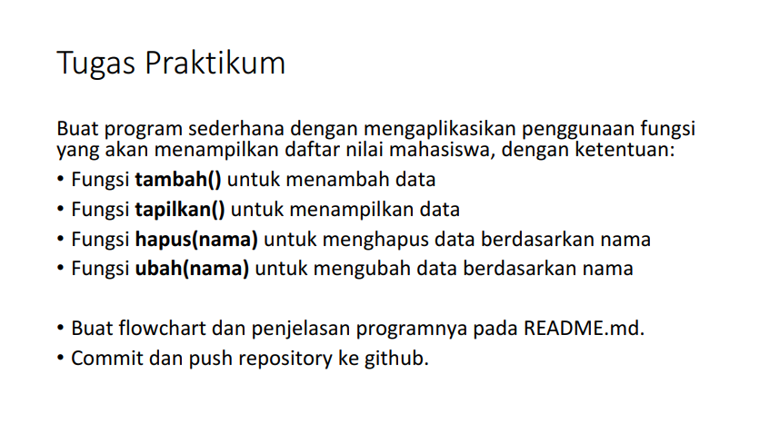
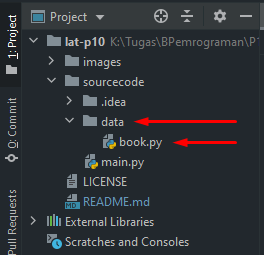
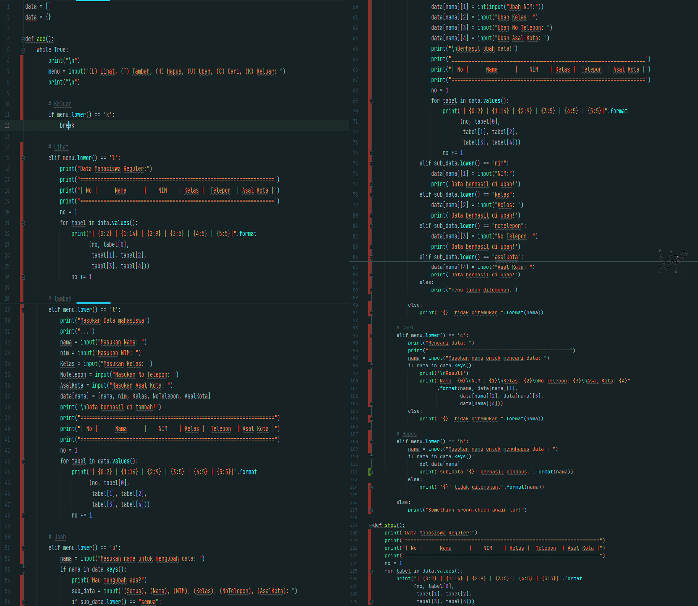

# Lab-6
Repository ini dibuat untuk memenuhi tugas di pertemuan-10  
***

**Berikut ini tugas yang diberikan oleh dosen saya :**  

  

Untuk membuat task diatas saya harus membuat 2 file.  
**Data** & **Main Script**
 
**Untuk membuat file **Data** tersebut saya menggunakan source code dibawah ini :**  

  

Kemudian kita *save* di folder sendiri, disini saya menyimpan file **Data** kedalam folder **Data** dan saya simpan dengan file name *book*.  

  

Source Code diatas berfungi sebagai berbagai *action syntax* yang nanti akan di run di file **Main Script**.
 
**Kemudian untuk file **Main Script** nya sendiri saya menggunakan source code sebagai berikut :**

  