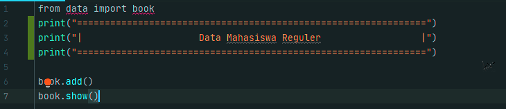

# Lab-6
Repository ini dibuat untuk memenuhi tugas di pertemuan-10  
***

**Berikut ini tugas yang diberikan oleh dosen saya :**  

  

Untuk membuat task diatas saya dengan source code sebagai berikut:  
**Data** & **Main Script**
 
 
**Untuk membuat file **Data** tersebut saya menggunakan source code dibawah ini :**  

  

Kemudian kita *save* di folder sendiri, disini saya menyimpan file **Data** kedalam folder **Data** dan saya simpan dengan file name *book*.  

  

Source Code diatas berfungi sebagai berbagai *action syntax* yang nanti akan di run di file **Main Script**.
 
**Kemudian untuk file **Main Script** nya sendiri saya menggunakan source code sebagai berikut :**

  

Cukup simpel bukan? Saya pun heran.  

**Kemudian setelah 2 file tersebut dibuat, lalu kita run. Maka akan menghasilkan output sebagai berikut:**

  

**Dan disitu kita punya 6 opsi:**  

**Lihat**  
**Tambah**  
**Hapus**  
**Ubah**  
**Cari**  
**Keluar**  

Mari kita coba opsi T (Tambah) dari source code **Book** diatas, maka output yang keluar adalah sebagai berikut :  

  

Berjalan sesuai dengan yang kita inginkan.  
 

**Sekarang kita akan mencoba opsi **Ubah**:**  

  

Data **Kelas** dari table sebelumnya berhasil kita ubah dengan opsi **Ubah**

***
## Penjelasan

- `from data import book` = Syntax ini berfungsi untung *menginport* file *book* dari folder data.

-  

-  